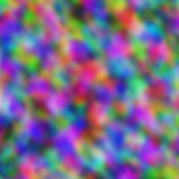
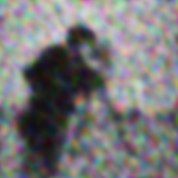
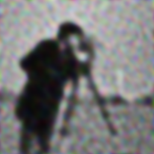
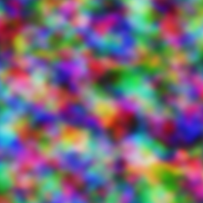
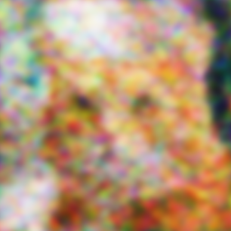
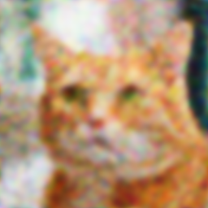

# SIREN: Implicit Neural Representations with Periodic Activation Functions
Pytorch implementation of the paper: 
  Sitzmann, V., Martel, J. N. P., Bergman, A. W., Lindell, D. B., & Wetzstein,
  G. (2020). *Implicit Neural Representations with Periodic Activation
  Functions*. NeurIPS 2020. [[Paper](https://proceedings.neurips.cc/paper/2020/file/53c04118df112c13a8c34b38343b9c10-Paper.pdf)]

SIREN uses sinusoidal activation functions to enable neural networks to
effectively represent complex, high-frequency signals such as images, videos,
audios, and 3D scenes. This makes SIREN especially powerful for tasks involving
implicit neural representations where a network models a signal as a continuous
function. 

## Quick Start
1) Ensure all required packages (defined in ./requirements.txt) are installed.
2) To encode the standard camera man image stored under "./data", from the root directory run:

```bash
python train.py --config_name=image.yaml
```
The tensorboard info will be saved under "./outputs/summaries".


## Encode custom images:
1) Put your image under "./data" directory.
2) Modify the "data_name" in "./config/image.yaml" to your image name. Modify other items as needed or keep the default.
3) From the root directory run:

```bash
python train.py --config_name=image.yaml
```

---

## Results

Example results are provided for two images. Each includes:

- The ground truth image.  
- 6 intermediate reconstruction images captured during training.  
- A video showing the reconstruction progress over time.  

**Ground Truth:**


**Intermediate Reconstructions:**






**Reconstruction Video:**

https://github.com/user-attachments/assets/8d017e25-6597-4ccc-92ab-93c642e1b8ee

---

**Ground Truth:**


**Intermediate Reconstructions:**






**Reconstruction Video:**

https://github.com/user-attachments/assets/f50813c7-7713-4587-a265-211c0d89924f

---

These results illustrate how the model progressively learns to encode the target image with increasing fidelity during training.


# Citation
Kudos to the authors for their amazing work:
```bibtex
@inproceedings{sitzmann2020siren,
  author    = {Sitzmann, Vincent and Martel, Julien N. P. and Bergman, Alexander W. and Lindell, David B. and Wetzstein, Gordon},
  title     = {Implicit Neural Representations with Periodic Activation Functions},
  booktitle = {Advances in Neural Information Processing Systems (NeurIPS)},
  year      = {2020}
}
```

However, if you use this implementation, please cite:
```bibtex
@misc{yourname_siren_pytorch_2026,
  author       = {Saeid Shahhosseini},
  title        = {SIREN PyTorch Implementation},
  year         = {2026},
  howpublished = {\url{https://github.com/kshahhosseini/SIREN}},
}
```
